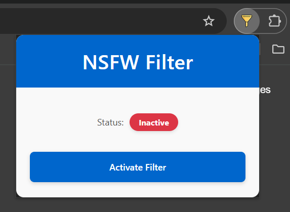
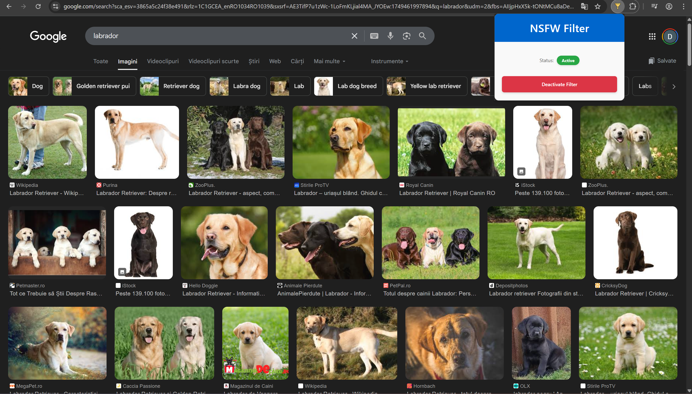

# Intelligent Content Filter - Bachelor's Thesis Project

This repository contains the source code for a browser extension developed as part of a bachelor's thesis titled "Intelligent system for automatic filtering of web content inappropriate for minors." The extension uses a deep learning model to identify and blur inappropriate images in real-time, directly within the browser, ensuring user privacy.

## Demo

To provide a clear visual demonstration of the extension, the images below are organized into a grid. You can see the popup interface on the left and the filtering functionality in a Google Images search on the right.

<table width="100%">
 <tr>
    <td align="center"><strong>Popup Interface</strong></td>
    <td align="center"><strong>Filtering in Action</strong></td>
 </tr>
 <tr>
    <td valign="top">
      <p align="center">
        <em>Filter Inactive</em><br>
        
      </p>
    </td>
    <td valign="top">
      <p align="center">
        <em>Inappropriate Content Blurred</em><br>
        
      </p>
    </td>
  </tr>
  <tr>
    <td valign="top">
        <p align="center">
          <em>Filter Active</em><br>
          
        </p>
    </td>
    <td valign="top">
      <p align="center">
        <em>Safe Content Visible</em><br>
        
      </p>
    </td>
  </tr>
</table>

## Features

*   **Real-Time Filtering:** Automatically detects and blurs inappropriate images as you browse.
*   **Privacy-Focused:** All image processing is done locally in your browser. No data is sent to external servers.
*   **User-Friendly Interface:** A simple popup allows you to easily toggle the filter on and off.
*   **Efficient Performance:** Built with modern technologies to minimize impact on browser performance.

## Tech Stack

*   **Frontend:** Vue.js, TypeScript, CSS
*   **Machine Learning:** TensorFlow.js
*   **Browser Extension API:** Chrome API
*   **Build Tool:** Vite
*   **Testing:** Jest and Puppeteer

## The Model

The core of this extension is a fine-tuned MobileNetV2 model.

*   **Architecture:** MobileNetV2 was chosen for its efficiency in resource-constrained environments like a browser.
*   **Training:** The model was pre-trained on ImageNet and then fine-tuned on a custom dataset of over 141,000 images.
*   **Dataset Categories:**
    1.  Pornographic
    2.  Sexually Suggestive (but not pornographic)
    3.  Pornographic Drawings
    4.  Appropriate Drawings
    5.  Appropriate
*   **Performance:** Achieved an accuracy of **88.85%** on the test set.
*   **Model Files:** The trained and converted TensorFlow.js model is located in the `/public` directory.

## Installation

To install and run this extension locally:

1.  **Clone the repository:**
    ```bash
    git clone https://github.com/Domynis/NSFW_Filtering_Extension.git
    ```
2.  **Navigate to the project directory:**
    ```bash
    cd NSFW_Filtering_Extension
    ```
3.  **Install dependencies:**
    ```bash
    npm install
    ```
4.  **Build the extension:**
    ```bash
    npm run build
    ```
5.  **Load the extension in Chrome:**
    *   Open Google Chrome and navigate to `chrome://extensions`.
    *   Enable "Developer mode" in the top right corner.
    *   Click "Load unpacked".
    *   Select the `dist` folder that was created in the project directory.

## Usage

Once installed, a new icon will appear in your Chrome toolbar. Click on it to open the popup and activate or deactivate the filter. When active, the extension will automatically blur inappropriate images on the web pages you visit.

## Future Improvements

*   **Video and GIF Filtering:** Extend the filtering capabilities to include video and animated GIFs.
*   **Adjustable Sensitivity:** Allow users to set the strictness of the filter.
*   **Performance Optimization:** Further refine the image processing logic for even faster performance.

## License

This project is released under the MIT License.

Copyright (c) 2025 Bács Dominic
